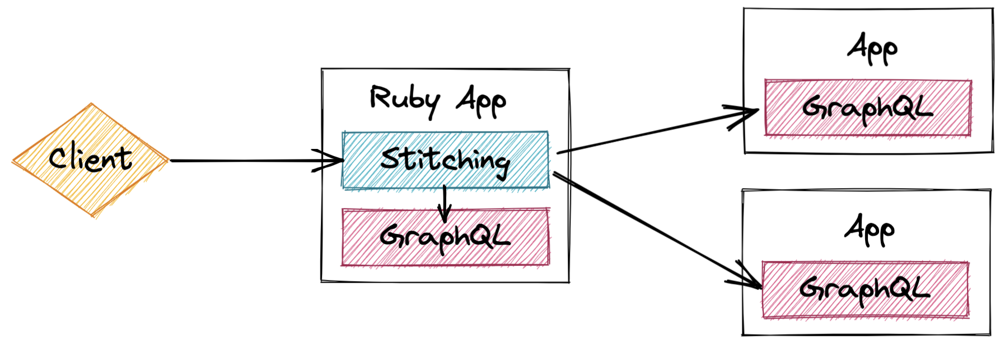
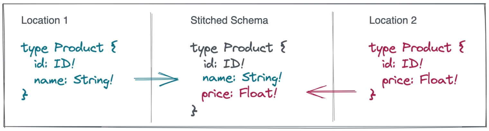

## GraphQL Stitching for Ruby

GraphQL stitching composes a single schema from multiple underlying GraphQL resources, then smartly proxies portions of incoming requests to their respective locations in dependency order and returns the merged results. This allows an entire location graph to be queried through one combined GraphQL surface area.



**Supports:**
- All operation types: query, mutation, and [subscription](./docs/subscriptions.md).
- Merged object and abstract types joining though multiple keys.
- Shared objects, fields, enums, and inputs across locations.
- Combining local and remote schemas.
- [File uploads](./docs/http_executable.md) via multipart forms.
- Tested with all minor versions of `graphql-ruby`.

**NOT Supported:**
- Computed fields (ie: federation-style `@requires`).
- Defer/stream.

This Ruby implementation is designed as a generic library to join basic spec-compliant GraphQL schemas using their existing types and fields in a [DIY](https://dictionary.cambridge.org/us/dictionary/english/diy) capacity. The opportunity here is for a Ruby application to stitch its local schemas together or onto remote sources without requiring an additional proxy service running in another language. For advanced federation features such as computed fields and managed schema deployments, consider more opinionated frameworks such as [Apollo Federation](https://www.apollographql.com/docs/federation/).

## Getting started

Add to your Gemfile:

```ruby
gem "graphql-stitching"
```

Run `bundle install`, then require unless running an autoloading framework (Rails, etc):

```ruby
require "graphql/stitching"
```

## Usage

The [`Client`](./docs/client.md) component builds a stitched graph wrapped in an executable workflow (with optional query plan caching hooks):

```ruby
movies_schema = <<~GRAPHQL
  type Movie { id: ID! name: String! }
  type Query { movie(id: ID!): Movie }
GRAPHQL

showtimes_schema = <<~GRAPHQL
  type Showtime { id: ID! time: String! }
  type Query { showtime(id: ID!): Showtime }
GRAPHQL

client = GraphQL::Stitching::Client.new(locations: {
  movies: {
    schema: GraphQL::Schema.from_definition(movies_schema),
    executable: GraphQL::Stitching::HttpExecutable.new(url: "http://localhost:3000"),
  },
  showtimes: {
    schema: GraphQL::Schema.from_definition(showtimes_schema),
    executable: GraphQL::Stitching::HttpExecutable.new(url: "http://localhost:3001"),
  },
  my_local: {
    schema: MyLocal::GraphQL::Schema,
  },
})

result = client.execute(
  query: "query FetchFromAll($movieId:ID!, $showtimeId:ID!){
    movie(id:$movieId) { name }
    showtime(id:$showtimeId): { time }
    myLocalField
  }",
  variables: { "movieId" => "1", "showtimeId" => "2" },
  operation_name: "FetchFromAll"
)
```

Schemas provided in [location settings](./docs/composer.md#performing-composition) may be class-based schemas with local resolvers (locally-executable schemas), or schemas built from SDL strings (schema definition language parsed using `GraphQL::Schema.from_definition`) and mapped to remote locations via [executables](#executables).

While `Client` is sufficient for most usecases, the library offers several discrete components that can be assembled into tailored workflows:

- [Composer](./docs/composer.md) - merges and validates many schemas into one supergraph.
- [Supergraph](./docs/supergraph.md) - manages the combined schema, location routing maps, and executable resources. Can be exported, cached, and rehydrated.
- [Request](./docs/request.md) - manages the lifecycle of a stitched GraphQL request.
- [HttpExecutable](./docs/http_executable.md) - proxies requests to remotes with multipart file upload support.

## Merged types

`Object` and `Interface` types may exist with different fields in different graph locations, and will get merged together in the combined schema.



To facilitate this merging of types, stitching must know how to cross-reference and fetch each variant of a type from its source location using [type resolver queries](#merged-type-resolver-queries). For those in an Apollo ecosystem, there's also _limited_ support for merging types though a [federation `_entities` protocol](./docs/federation_entities.md).

### Merged type resolver queries

Types merge through resolver queries identified by a `@stitch` directive:

```graphql
directive @stitch(key: String!, arguments: String) repeatable on FIELD_DEFINITION
```

This directive (or [static configuration](#sdl-based-schemas)) is applied to root queries where a merged type may be accessed in each location, and a `key` argument specifies a field needed from other locations to be used as a query argument.

```ruby
products_schema = <<~GRAPHQL
  directive @stitch(key: String!, arguments: String) repeatable on FIELD_DEFINITION

  type Product {
    id: ID!
    name: String!
  }

  type Query {
    product(id: ID!): Product @stitch(key: "id")
  }
GRAPHQL

catalog_schema = <<~GRAPHQL
  directive @stitch(key: String!, arguments: String) repeatable on FIELD_DEFINITION

  type Product {
    id: ID!
    price: Float!
  }

  type Query {
    products(ids: [ID!]!): [Product]! @stitch(key: "id")
  }
GRAPHQL

client = GraphQL::Stitching::Client.new(locations: {
  products: {
    schema: GraphQL::Schema.from_definition(products_schema),
    executable:  GraphQL::Stitching::HttpExecutable.new(url: "http://localhost:3001"),
  },
  catalog: {
    schema: GraphQL::Schema.from_definition(catalog_schema),
    executable:  GraphQL::Stitching::HttpExecutable.new(url: "http://localhost:3002"),
  },
})
```

Focusing on the `@stitch` directive usage:

```graphql
type Product {
  id: ID!
  name: String!
}
type Query {
  product(id: ID!): Product @stitch(key: "id")
}
```

* The `@stitch` directive is applied to a root query where the merged type may be accessed. The merged type identity is inferred from the field return.
* The `key: "id"` parameter indicates that an `{ id }` must be selected from prior locations so it may be submitted as an argument to this query. The query argument used to send the key is inferred when possible ([more on arguments](#argument-shapes) later).

Each location that provides a unique variant of a type must provide at least one resolver query for the type. The exception to this requirement are [outbound-only types](./docs/mechanics.md#outbound-only-merged-types) and/or [foreign key types](./docs/mechanics.md##modeling-foreign-keys-for-stitching) that contain no exclusive data:

```graphql
type Product {
  id: ID!
}
```

The above representation of a `Product` type contains nothing but a key that is available in other locations. Therefore, this representation will never require an inbound request to fetch it, and its resolver query may be omitted.

#### List queries

It's okay ([even preferable](#batching) in most circumstances) to provide a list accessor as a resolver query. The only requirement is that both the field argument and return type must be lists, and the query results are expected to be a mapped set with `null` holding the position of missing results.

```graphql
type Query {
  products(ids: [ID!]!): [Product]! @stitch(key: "id")
}

# input:  ["1", "2", "3"]
# result: [{ id: "1" }, null, { id: "3" }]
```

See [error handling](./docs/mechanics.md#stitched-errors) tips for list queries.

#### Abstract queries

It's okay for resolver queries to be implemented through abstract types. An abstract query will provide access to all of its possible types by default, each of which must implement the key.

```graphql
interface Node {
  id: ID!
}
type Product implements Node {
  id: ID!
  name: String!
}
type Query {
  nodes(ids: [ID!]!): [Node]! @stitch(key: "id")
}
```

To customize which types an abstract query provides and their respective keys, you may extend the `@stitch` directive with a `typeName` constraint. This can be repeated to select multiple types.

```graphql
directive @stitch(key: String!, arguments: String, typeName: String) repeatable on FIELD_DEFINITION

type Product { sku: ID! }
type Order { id: ID! }
type Customer { id: ID! } # << not stitched
union Entity = Product | Order | Customer

type Query {
  entity(key: ID!): Entity
    @stitch(key: "sku", typeName: "Product")
    @stitch(key: "id", typeName: "Order")
}
```

#### Argument shapes

Stitching infers which argument to use for queries with a single argument, or when the key name matches its intended argument. For custom mappings, the `arguments` option may specify a template of GraphQL arguments that insert key selections:

```graphql
type Product {
  id: ID!
}
type Query {
  product(byId: ID, bySku: ID): Product
    @stitch(key: "id", arguments: "byId: $.id")
}
```

Key insertions are prefixed by `$` and specify a dot-notation path to any selections made by the resolver key, or `__typename`. This syntax allows sending multiple arguments that intermix stitching keys with complex input shapes and other static values:

```graphql
type Product {
  id: ID!
}
union Entity = Product
input EntityKey {
  id: ID!
  type: String!
}
enum EntitySource {
  DATABASE
  CACHE
}

type Query {
  entities(keys: [EntityKey!]!, source: EntitySource = DATABASE): [Entity]!
    @stitch(key: "id", arguments: "keys: { id: $.id, type: $.__typename }, source: CACHE")
}
```

See [resolver arguments](./docs/type_resolver.md#arguments) for full documentation on shaping input.

#### Composite type keys

Resolver keys may make composite selections for multiple key fields and/or nested scopes, for example:

```graphql
interface FieldOwner {
  id: ID!
  type: String!
}
type CustomField {
  owner: FieldOwner!
  key: String!
  value: String
}
input CustomFieldLookup {
  ownerId: ID!
  ownerType: String!
  key: String!
}

type Query {
  customFields(lookups: [CustomFieldLookup!]!): [CustomField]! @stitch(
    key: "owner { id type } key",
    arguments: "lookups: { ownerId: $.owner.id, ownerType: $.owner.type, key: $.key }"
  )
}
```

Note that composite key selections may _not_ be distributed across locations. The complete selection criteria must be available in each location that provides the key.

#### Multiple type keys

A type may exist in multiple locations across the graph using different keys, for example:

```graphql
type Product { id:ID! }          # storefronts location
type Product { id:ID! sku:ID! }  # products location
type Product { sku:ID! }         # catelog location
```

In the above graph, the `storefronts` and `catelog` locations have different keys that join through an intermediary. This pattern is perfectly valid and resolvable as long as the intermediary provides resolver queries for each possible key:

```graphql
type Product {
  id: ID!
  sku: ID!
}
type Query {
  productById(id: ID!): Product @stitch(key: "id")
  productBySku(sku: ID!): Product @stitch(key: "sku")
}
```

The `@stitch` directive is also repeatable, allowing a single query to associate with multiple keys:

```graphql
type Product {
  id: ID!
  sku: ID!
}
type Query {
  product(id: ID, sku: ID): Product @stitch(key: "id") @stitch(key: "sku")
}
```

#### Class-based schemas

The `@stitch` directive can be added to class-based schemas with a directive class:

```ruby
class StitchingResolver < GraphQL::Schema::Directive
  graphql_name "stitch"
  locations FIELD_DEFINITION
  repeatable true
  argument :key, String, required: true
  argument :arguments, String, required: false
end

class Query < GraphQL::Schema::Object
  field :product, Product, null: false do
    directive StitchingResolver, key: "id"
    argument :id, ID, required: true
  end
end
```

The `@stitch` directive can be exported from a class-based schema to an SDL string by calling `schema.to_definition`.

#### SDL-based schemas

A clean schema may also have stitching directives applied via static configuration by passing a `stitch` array in [location settings](./docs/composer.md#performing-composition):

```ruby
sdl_string = <<~GRAPHQL
  type Product {
    id: ID!
    sku: ID!
  }
  type Query {
    productById(id: ID!): Product
    productBySku(sku: ID!): Product
  }
GRAPHQL

supergraph = GraphQL::Stitching::Composer.new.perform({
  products:  {
    schema: GraphQL::Schema.from_definition(sdl_string),
    executable: ->() { ... },
    stitch: [
      { field_name: "productById", key: "id" },
      { field_name: "productBySku", key: "sku", arguments: "mySku: $.sku" },
    ]
  },
  # ...
})
```

#### Custom directive names

The library is configured to use a `@stitch` directive by default. You may customize this by setting a new name during initialization:

```ruby
GraphQL::Stitching.stitch_directive = "resolver"
```

## Executables

An executable resource performs location-specific GraphQL requests. Executables may be `GraphQL::Schema` classes, or any object that responds to `.call(request, source, variables)` and returns a raw GraphQL response:

```ruby
class MyExecutable
  def call(request, source, variables)
    # process a GraphQL request...
    return {
      "data" => { ... },
      "errors" => [ ... ],
    }
  end
end
```

A [Supergraph](./docs/supergraph.md) is composed with executable resources provided for each location. Any location that omits the `executable` option will use the provided `schema` as its default executable:

```ruby
supergraph = GraphQL::Stitching::Composer.new.perform({
  first: {
    schema: FirstSchema,
    # executable:^^^^^^ delegates to FirstSchema,
  },
  second: {
    schema: SecondSchema,
    executable: GraphQL::Stitching::HttpExecutable.new(url: "http://localhost:3001", headers: { ... }),
  },
  third: {
    schema: ThirdSchema,
    executable: MyExecutable.new,
  },
  fourth: {
    schema: FourthSchema,
    executable: ->(req, query, vars) { ... },
  },
})
```

The `GraphQL::Stitching::HttpExecutable` class is provided as a simple executable wrapper around `Net::HTTP.post` with [file upload](./docs/http_executable.md#graphql-file-uploads) support. You should build your own executables to leverage your existing libraries and to add instrumentation. Note that you must manually assign all executables to a `Supergraph` when rehydrating it from cache ([see docs](./docs/supergraph.md)).

## Batching

The stitching executor automatically batches subgraph requests so that only one request is made per location per generation of data. This is done using batched queries that combine all data access for a given a location. For example:

```graphql
query MyOperation_2($_0_key:[ID!]!, $_1_0_key:ID!, $_1_1_key:ID!, $_1_2_key:ID!) {
  _0_result: widgets(ids: $_0_key) { ... } # << 3 Widget
  _1_0_result: sprocket(id: $_1_0_key) { ... } # << 1 Sprocket
  _1_1_result: sprocket(id: $_1_1_key) { ... } # << 1 Sprocket
  _1_2_result: sprocket(id: $_1_2_key) { ... } # << 1 Sprocket
}
```

Tips:

* List queries (like the `widgets` selection above) are generally preferable as resolver queries because they keep the batched document consistent regardless of set size, and make for smaller documents that parse and validate faster.
* Assure that root field resolvers across your subgraph implement batching to anticipate cases like the three `sprocket` selections above.

Otherwise, there's no developer intervention necessary (or generally possible) to improve upon data access. Note that multiple generations of data may still force the executor to return to a previous location for more data.

## Concurrency

The [Executor](./docs/executor.md) component builds atop the Ruby fiber-based implementation of `GraphQL::Dataloader`. Non-blocking concurrency requires setting a fiber scheduler via `Fiber.set_scheduler`, see [graphql-ruby docs](https://graphql-ruby.org/dataloader/nonblocking.html). You may also need to build your own remote clients using corresponding HTTP libraries.

## Additional topics

- [Modeling foreign keys for stitching](./docs/mechanics.md##modeling-foreign-keys-for-stitching)
- [Deploying a stitched schema](./docs/mechanics.md#deploying-a-stitched-schema)
- [Schema composition merge patterns](./docs/composer.md#merge-patterns)
- [Subscriptions tutorial](./docs/subscriptions.md)
- [Field selection routing](./docs/mechanics.md#field-selection-routing)
- [Root selection routing](./docs/mechanics.md#root-selection-routing)
- [Stitched errors](./docs/mechanics.md#stitched-errors)
- [Null results](./docs/mechanics.md#null-results)

## Examples

This repo includes working examples of stitched schemas running across small Rack servers. Clone the repo, `cd` into each example and try running it following its README instructions.

- [Merged types](./examples/merged_types)
- [File uploads](./examples/file_uploads)
- [Subscriptions](./examples/subscriptions)

## Tests

```shell
bundle install
bundle exec rake test [TEST=path/to/test.rb]
```
