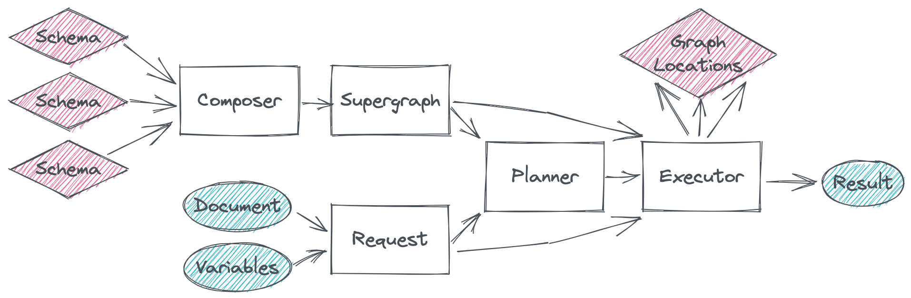

## GraphQL::Stitching

This module provides a collection of components that may be composed into a stitched schema.

Major components include:

- [Gateway](./gateway.md) - an out-of-the-box stitching configuration.
- [Composer](./composer.md) - merges and validates many schemas into one graph.
- [Supergraph](./supergraph.md) - manages the combined schema and location routing maps. Can be exported, cached, and rehydrated.
- [Document](./document.md) - manages a parsed GraphQL request document.
- [Planner](./planner.md) - builds a cacheable query plan for a request document.
- [Executor](./executor.md) - executes a query plan with given request variables.
