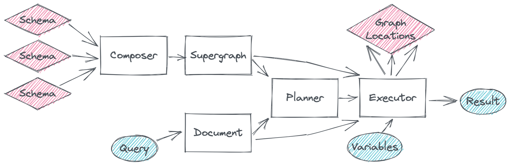

## What is Stitching?

You've probably done this: fetch some objects from an endpoint; then map those into a collection of keys that gets sent to another endpoint for more data; then hook all the results together in your client. This is stitching. GraphQL stitching simply automates this process so that one large _supergraph_ schema can transparently query from many _subgraph_ locations.

## Stitching vs. Federation

Stitching encompasses the raw mechanics of combining GraphQL schemas with cross-referenced objects, and is the underpinning mechanics for major federation frameworks such as [Apollo Federation](https://www.apollographql.com/federation) and [Wundergraph](https://wundergraph.com/). Stitching is generic library behavior that plugs into your server, while federation ecosystems _give you_ a server, a schema deployment pipeline, a control plane, and opinionated management workflows.

If you're scaling a large distributed architecture with heavy throughput demands, then you'll probably benefit from growing atop a major federation framework. However, if you just have an existing Ruby app and want to hook a few external schemas into its GraphQL API, then incorporating an entire federation framework is probably overkill. Stitching offers good middleground.

## The `GraphQL::Stitching` library

This library contains the component parts for assembling a stitched schema, and rolls the entire workflow up into a `GraphQL::Stitching::Client` class.

For the most part, this entire library can be driven using just a `Client`. First [compose a supergraph](./composing_a_supergraph.md) with [executables](./executables.md) for each location, configure its [merged types](./merged_types.md), and then [serve the client](./serving_a_supergraph.md) in your app's GraphQL controller.
